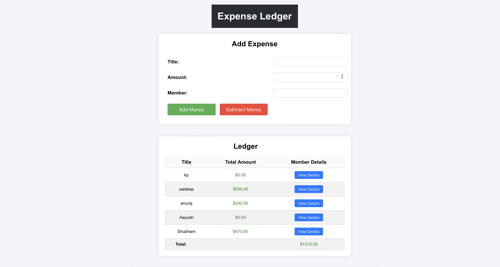
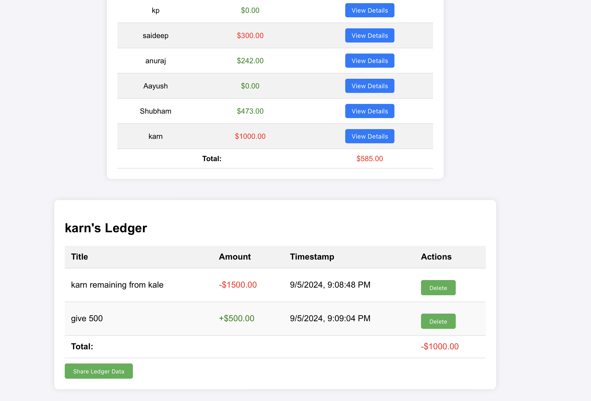

<!DOCTYPE html>
<html lang="en">
<head>
    <meta charset="UTF-8">
    <meta name="viewport" content="width=device-width, initial-scale=1.0">
</head>
<body>
    

        <h1>Ledger Book</h1>
        
The Ledger Book is a simple and effective way to track daily expenses for multiple members. It allows you to add or subtract expenses, group them by member, and view detailed ledgers for each member.

        <h2>Screenshots</h2>
        

            <h3>Main Form</h3>
            
        

        

            <h3>Member Ledger</h3>
            
        

        

            <h2>Features</h2>
            <ul>
                <li>Simple form to add or subtract expenses.</li>
                <li>Group expenses by member with a view of each member’s ledger.</li>
                <li>Visual color indicators (green for positive, red for negative) for each transaction.</li>
                <li>Ability to click on a member and view the detailed history of transactions.</li>
            </ul>
        

        <h2>How to Use</h2>
        <ol>
            <li>Clone the repository from GitHub.</li>
            <li>Install the required dependencies by running <code>npm install</code>.</li>
            <li>Start the application using <code>npm start</code>.</li>
            <li>Use the form to add or subtract expenses and view member-specific ledgers.</li>
        </ol>
        <a href="[https:https://github.com/sandykhot10/Expense-Application](https://github.com/sandykhot10/Expense-Application)" class="cta-button">View on GitHub</a>
        

            
&copy; 2024 Ledger Book. All rights reserved.

        

    

</body>
</html>
